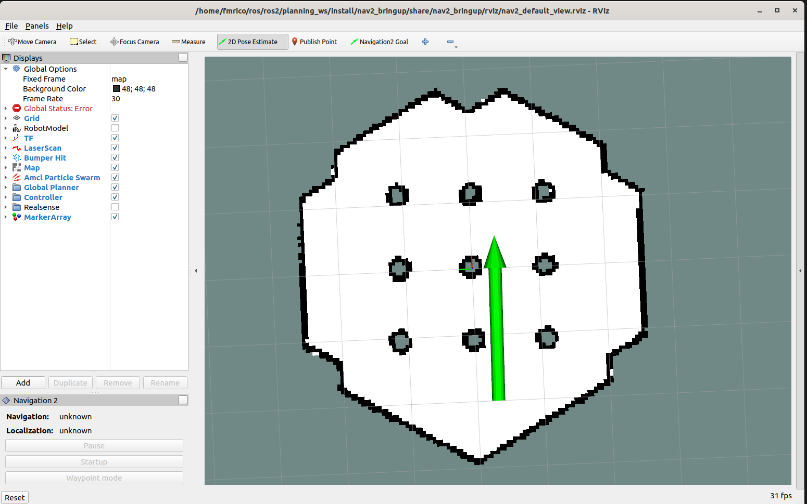
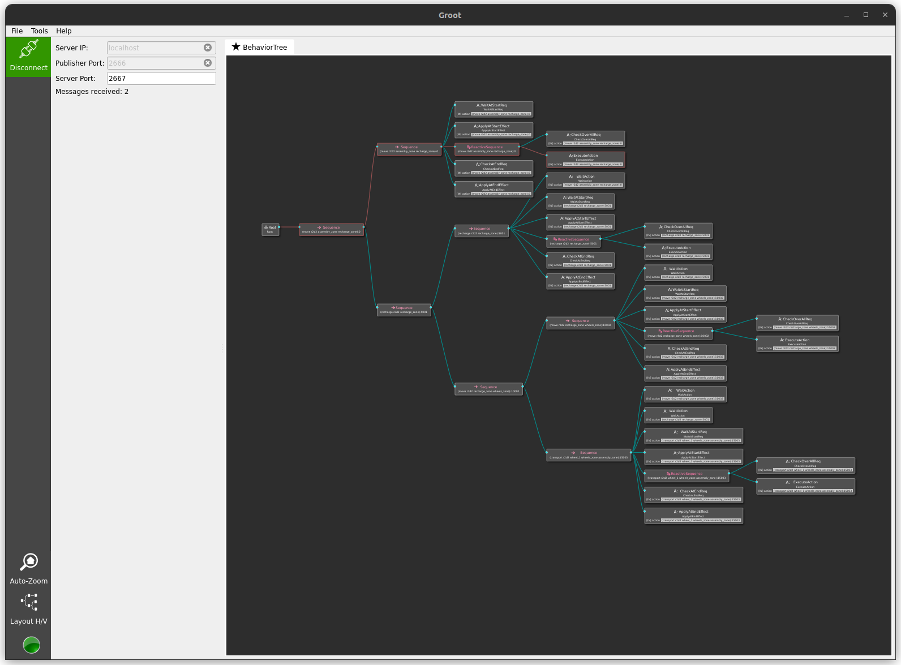

# PlanSys2 Behavior Tree Example

## Description

This example shows how to use Behavior Trees to carry out the tasks that an action requires. Each action has an xml file that defines a behavior tree.
- In `src` the actions are implemented.
- In `src / behavior_tree_nodes` BT nodes.

See https://github.com/IntelligentRoboticsLabs/ros2_planning_system/pull/27 for details.

## Prerequisites
```bash
sudo apt-get install ros-humble-turtlebot3*
```

## How to run

### In terminal 1:

```bash
export GAZEBO_MODEL_PATH=$GAZEBO_MODEL_PATH:/opt/ros/humble/share/turtlebot3_gazebo/models
export TURTLEBOT3_MODEL=waffle
source /usr/share/gazebo/setup.sh
source install/setup.bash
ros2 launch nav2_bringup tb3_simulation_launch.py headless:=False
```

This launches Navigation2. Use rviz to set the robot position, as shown here:

 

Or use the commandline (e.g. in terminal 2):
```bash
ros2 topic pub --once /initialpose geometry_msgs/msg/PoseWithCovarianceStamped "{header: {stamp: {sec: 0, nanosec: 0}, frame_id: 'map'}, pose:{pose: {position: {x: -2.0, y: -0.5, z: 0.01}, orientation: {x: 0.0, y: 0.0, z: 0.0, w: 1.0}}}}"
```

### In terminal 2:

```bash
source install/setup.bash
ros2 launch plansys2_bt_example plansys2_bt_example_launch.py
```

### In terminal 3:

There are two options in this example. First option is to use the plansys2 terminal. Secondly you can use the custom assemble controller. Both options are shown below.

```bash
source install/setup.bash

# before you run the commands below, it seems the starting location must be different to prevent an error
ros2 topic pub --times 3 /goal_pose geometry_msgs/PoseStamped "{header: {stamp: {sec: 0}, frame_id: 'map'}, pose: {position: {x: -0.4, y: 0.4, z: 0.01}, orientation: {w: 0.0}}}"

ros2 run plansys2_terminal plansys2_terminal
```

Enter it manually, line by line:

```text
set instance r2d2 robot
set instance recharge_zone zone
set instance wheels_zone zone
set instance steering_wheels_zone zone
set instance body_car_zone zone
set instance assembly_zone zone
set instance wheel_1 piece
set instance body_car_1 piece
set instance steering_wheel_1 piece
set predicate (robot_available r2d2)
set predicate (robot_at r2d2 assembly_zone)
set predicate (is_recharge_zone recharge_zone)
set predicate (piece_at wheel_1 wheels_zone)
set predicate (piece_at body_car_1 body_car_zone)
set predicate (piece_at steering_wheel_1 steering_wheels_zone)
set goal (and(piece_at wheel_1 assembly_zone))
run
```
You can also paste the problem above into a file (e.g. problem.txt), start the plansys2_terminal and enter the following:

```text
source problem.txt
```
Or use a custom controller:

```bash
source install/setup.bash
$HOME/dev_ws/build/plansys2_bt_example/assemble_controller_node
```
NOTE: this problem domain is different from example entered in the plansys2 terminal.

### In terminal 4 (optional):

NOTE: this is not working right now due to the upgrade to BT.CPP v4

To monitor the behaviortree in Groot, type the following to connect it to the plansys2 executor:
```bash
$HOME/dev_ws/build/groot/Groot --mode monitor --publisher_port 2666 --server_port 2667 --autoconnect
```

NOTE: best way is to run commands above just after you have followed the instructions as mentioned in `In terminal 3`.


